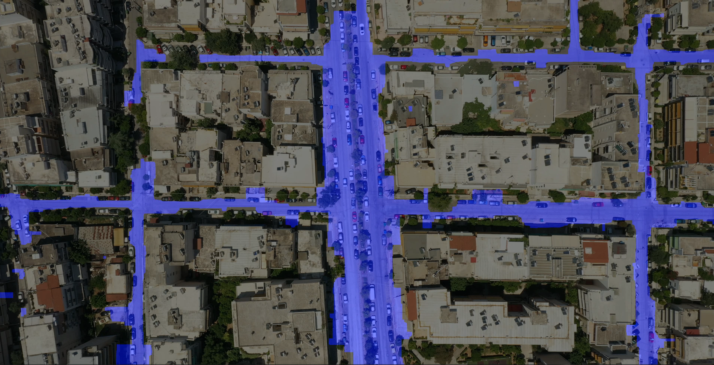
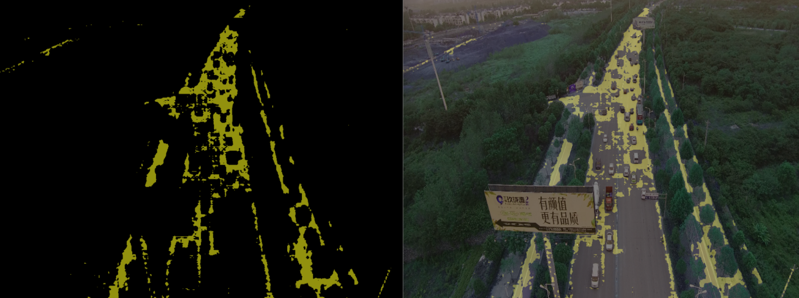
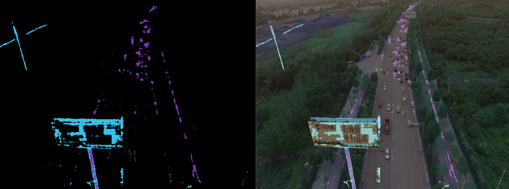
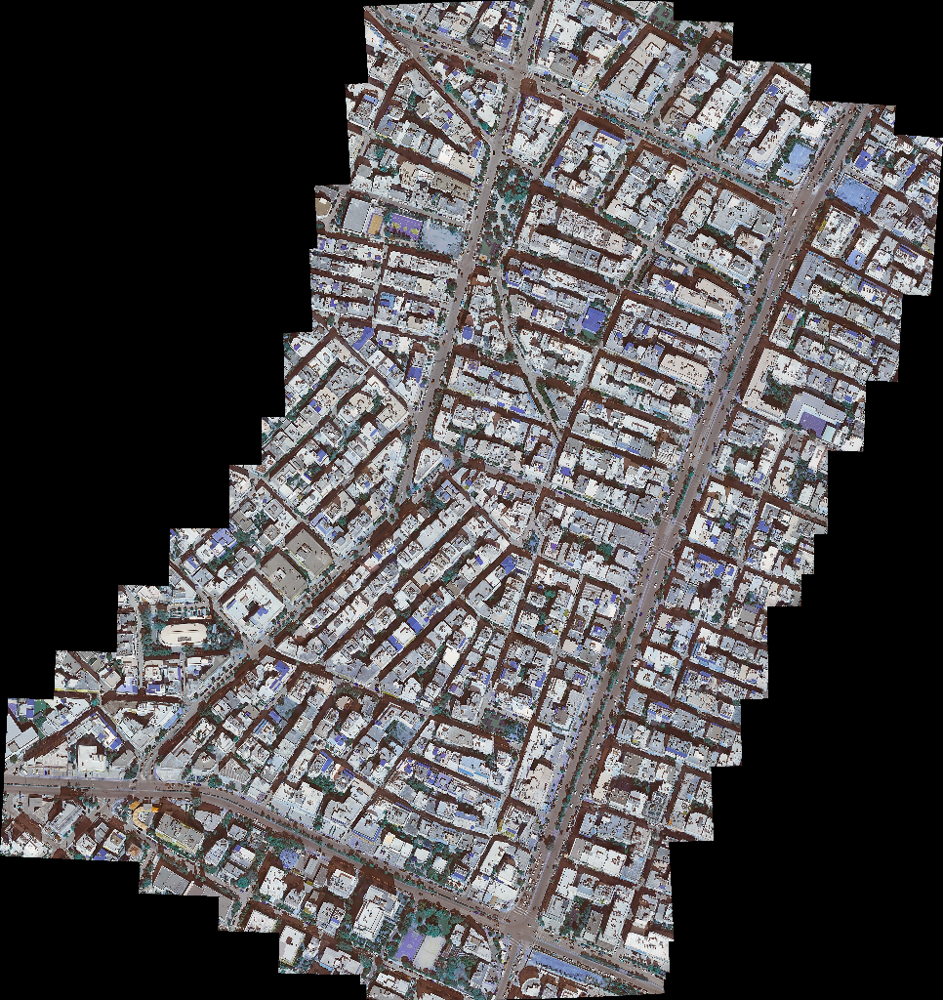
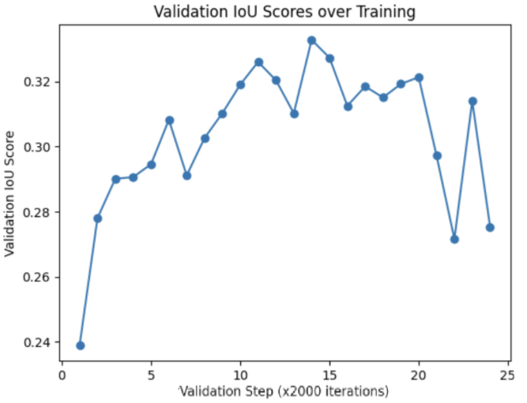

# Road and Occlusion Segmentation from Drone Video

**EPFL · Urban Transport Systems Laboratory (LUTS) · Semester Project · January 2025**

UAVs give traffic engineers flexible aerial coverage, but turning that footage into usable road
geometry is hard: vehicles occlude the very roadway you are trying to segment, road appearance
varies, and urban scenes are cluttered. This project builds a road-segmentation pipeline around
**Meta's Segment Anything (SAM / SAM 2)**, handles occlusion explicitly, and validates the result
by **stitching Google Earth frames into a satellite reference** and matching against it.

📄 **[Full report (PDF)](BOUBAKRY_Report.pdf)**: literature review of segmentation and feature
matching methods, the stitching pipeline, fine-tuning setup and full results.



*Road segmentation on a drone frame. The mask follows the carriageway through parked-car rows and
intersections, the occlusion case the project targets.*

---

## The pipeline

```
   drone video                          Google Earth frames
        │                                       │
        │                                       ▼
        │                              ┌────────────────────┐
        │                              │ OpenStitching      │
        │                              │ ORB features →     │
        │                              │ match → warp →     │
        │                              │ seam → blend       │
        │                              └─────────┬──────────┘
        │                                        │ satellite reference
        ▼                                        ▼
   ┌─────────────────────────────────────────────────────┐
   │ SAM / SAM 2, fine-tuned on annotated road imagery   │
   │  prompt encoder ← points + previous mask            │
   │  occlusion handling: vehicle removal before the     │
   │  road mask is formed                                │
   └───────────────────────┬─────────────────────────────┘
                           ▼
                    road masks, validated against
                    the stitched satellite view
```

### 1. Segmentation model

The report reviews **SAM**, **EfficientSAM** and **SAM 2** before settling on the SAM family. The
architecture that matters here is the three-part split into image encoder (ViT, MAE-pretrained),
prompt encoder and mask decoder. The prompt encoder is the lever this project pulls: road
segmentation is driven by **point prompts plus a previous mask**, rather than by a single
forward pass.

| Without prompts | With mask + point prompts |
|---|---|
|  |  |

*The same UAVid frame, segmented without any prompt (left) and with points plus the previous
mask fed to the prompt encoder (right). Conditioning on the previous mask is what makes the
segmentation stable across a video rather than flickering frame to frame.*

### 2. Occlusion handling

Vehicles sit on top of exactly the surface being segmented. The pipeline isolates them into their
own mask, then feeds vehicle-derived points into the prompt encoder so the road mask is completed
underneath them rather than broken by them. Morphological operators clean up the resulting masks.

### 3. Feature matching and stitching

To check that the segmentation generalizes rather than overfitting one video, the drone footage
is compared against a satellite reference built from Google Earth frames. The report benchmarks
**SIFT, ORB, LightGlue, SuperGlue and LoFTR**; the stitching itself runs through the
**OpenStitching** framework (ORB features → matching → warping → seam estimation → blending).



*The Galatsi (Athens) study area, stitched from Google Earth frames into a single reference
image. The stepped outline is the union of the individual frame footprints.*

### 4. Fine-tuning

The model is fine-tuned on annotated road imagery, with augmentation to cover the appearance
variation between the drone footage and the satellite reference.



*Validation IoU across training iterations.*

---

## Repository contents

```
BOUBAKRY_Report.pdf     the full report
TrainSAM2.ipynb         SAM 2 fine-tuning notebook
misc/                   dataset preparation utilities
parsed_results.txt      parsed evaluation output
figures/                figures used by this README, extracted from the report
```

| Script | Purpose |
|---|---|
| `misc/augmentation.py` | Training-time image augmentation |
| `misc/crop.py` | Crop frames to the working region |
| `misc/resolution.py` | Resolution normalization |
| `misc/black2blue.py` | Recolour masks for overlay rendering |
| `misc/erase.py` | Remove annotation artifacts |
| `misc/rename_jpg.py` | Bulk dataset renaming |
| `misc/validation.py` | Validation-split helper |

### Not in this repository

Three categories of file are excluded via `.gitignore`, all of them either third-party or too
large for GitHub's 100 MB per-file limit:

| Excluded | Size | Why | Where to get it |
|---|---|---|---|
| `SAM2/` | n/a | Meta's Segment Anything 2, vendored unmodified | [facebookresearch/sam2](https://github.com/facebookresearch/sam2) |
| `stitching-main/` | n/a | The OpenStitching library, vendored unmodified | [OpenStitching/stitching](https://github.com/OpenStitching/stitching) |
| `SAM2/checkpoints/*.pt` | 152–877 MB | Meta's pretrained SAM 2 weights | `SAM2/checkpoints/download_ckpts.sh` |
| `SEG_Model.torch` | 180 MB | The fine-tuned segmentation model | n/a |
| `final_vid.avi` | 1.7 GB | Rendered output video | n/a |

The local working copy is ~3.9 GB; what is tracked here is ~85 MB. To reproduce, clone the two
upstream repositories into `SAM2/` and `stitching-main/` and run the checkpoint download script.

> The report PDF is 78 MB, under GitHub's hard limit but large, because it embeds the
> full-resolution stitched mosaics. Expect a slow first clone.

---

## Author

**Ahmed Boubakry**, EPFL, Section de Microtechnique

- Supervisor: **Prof. Nikolas Geroliminis**
- Teacher: **Yura Tak**
- Laboratory: Urban Transport Systems Laboratory (LUTS)

## Key references

Segment Anything (Kirillov et al., Meta AI) · SAM 2 · EfficientSAM · SIFT (Lowe) ·
LightGlue (Lindenberger et al.) · SuperGlue (Sarlin et al.) · LoFTR (Sun et al.) · ORB ·
OpenStitching · UAVid dataset. Full list in the report.
